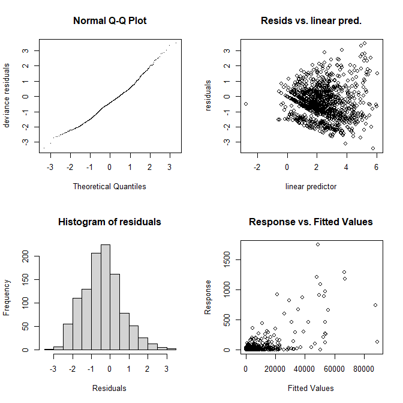

Mackerel eggs 2010, gam.check() figure:

# 
Mackerel eggs 2010, plot.gam() figure:

_Figure.png)
# 
Mackerel eggs 2010, fields image.plot():

.png)
#
Mackerel eggs 2010, .filled.contour() figure:

_Figure.png)
# 
Mackerel eggs 2010, .filled.contour() with various contour levels:

_Various_Levels.png)
# 
