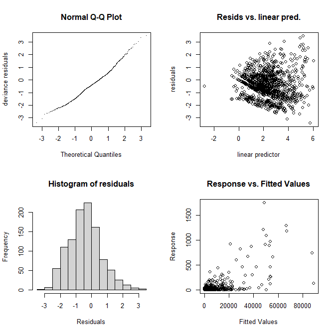

R code (inside the 'R' folder) to closely recreate the analysis in the methods paper :

##### A Generalized Fellner-Schall Method for Smoothing Parameter Optimization with Application to Tweedie Location, Scale and Shape Models

##### https://onlinelibrary.wiley.com/doi/epdf/10.1111/biom.12666

# 

The GAM model for the 2010 mackerel egg count data uses low rank isotropic splines on the spatial data (long/lat)

      mgcv::gam(list(count ~ s(lo, la, bs = "ds", m = c(1, .5), k = 150), ...), ...)  # ?smooth.construct.ds.smooth.spec

the Fellner-Schall optimizer method

     mgcv::gam(..., optimizer = "efs")  # ?gam

with a Tweedie error model 

     mgcv::gam(..., family = twlss())  # ?twlss
     
where the shape and scale parameters vary by square root of bottom depth (See the Help section in ?twlss and the methods paper.)
     
     mgcv::gam(list(count ~ ..., ~ s(I(b.depth^.5), bs = "cr", k = 10), ~ s(I(b.depth^.5), bs = "cr", k = 10)), ...)
     
Vessel is also included as a random variable 

     mgcv::gam(list(count ~ ... +  s(ship, bs = "re") + ...), ...)  # Random effects section in ?smooth.terms 

and the log volume of the net 

     mgcv::gam(list(count ~ ... + offset(log.vol) + ...), ...) 
     
is used as an offset.
     
#

R packages:
- mgcv
 ``` r
 Generalized additive (mixed) models, some of their extensions and other generalized ridge regression with
 multiple smoothing parameter estimation by (Restricted) Marginal Likelihood, Generalized Cross Validation
 and similar, or using iterated nested Laplace approximation for fully Bayesian inference. See Wood (2017)
 <doi:10.1201/9781315370279> for an overview.  Includes a gam() function, a wide variety of smoothers, 'JAGS'
 support and distributions beyond the exponential family.

 ``` 
- gamair
``` r
Data sets and scripts used in the book 'Generalized Additive Models: An Introduction with R', Wood
(2006,2017) CRC.
``` 

- fields
``` r
For curve, surface and function fitting with an emphasis on splines, spatial data, geostatistics, and
spatial statistics. The major methods include cubic, and thin plate splines, Kriging, and compactly supported
covariance functions for large data sets. ...
```

#

Additional figures besides those in the paper were looked at.

Mackerel eggs 2010, gam.check() figure:


# 
Mackerel eggs 2010, plot.gam() figure:

_Figure.png)
# 
Mackerel eggs 2010, fields image.plot():

.png)
#
Mackerel eggs 2010, graphics::.filled.contour() figure:

_Figure.png)
# 
Mackerel eggs 2010, graphics::.filled.contour() with various contour levels:

_Various_Levels.png)
# 
